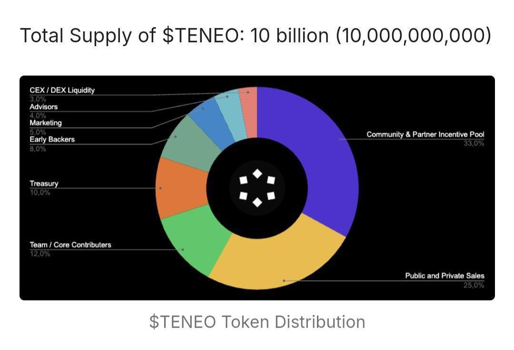

### TENEO EXTENSION NODE BOT



---

## BOT FEATURE
- Multi Account 
- Proxy Support (HTTP / SOCKS5)
- Auto Run Teneo Node


---

## TENEO EXTENSION NODE AIRDROP

Airdrop
New Airdrops: Teneo Node Ektension 

Hope im not late enough
[Download Extension](https://chromewebstore.google.com/detail/teneo-community-node/emcclcoaglgcpoognfiggmhnhgabppkm)
- Install Extension
- Login / Create Account
- Enter Ref Code : ```wi3fG```  (USE REF GOT 2500 Points)
- Verify Email
- Run Nodes Ektension 
- LFG


---

## Setup & Configure BOT

### Linux
1. Clone project repo
   ```
   git clone https://github.com/Rambeboy/Teneo-Node.git && cd Teneo-Node
   ```
2. Run
   ```
   npm install && npm run setup
   ```
3. Configure your accounts
   ```
   nano accounts/accounts.js
   ```
4. Configure the bot config
   ```
   nano config/config.js
   ```
5. Configure the proxy
   ```
   nano config/proxy_list.js
   ```
6. Run Bot
   ```
   npm run start
   ```
   
---

### Windows
1. Open your `Command Prompt` or `Power Shell`.
2. Clone project repo
   ```
   git clone https://github.com/Rambeboy/Teneo-Node.git && cd Teneo-Node
   ```
3. Run 
   ```
   npm install && npm run setup
   ```
5. Navigate to `teneo-node-bot` directory. 
6. Navigate to `accounts` folder and rename `accounts_tmp.js` to `accounts.js`.
7. Now open `acccounts.js` and setup your accounts.
8. Navigate to `config` and adjust the `config.js` as needed.
9. Also Configure proxy if you want to use proxy, by open `proxy_list.js`. (if you have 5 accounts, proxy is required)
10. Back to `teneo-node-bot` directory.
11. To start the app open your `Command Prompt` or `Power Shell`
12. Run Bot
    ```
    npm start
    ```

---

## Update Bot

To update bot follow this step :
1. run
   ```
   git pull
   ```
   or
   ```
   git pull --rebase
   ```
   if error run
   ```
   git stash && git pull
   ```
2. run
   ```
   npm update
   ```
2. start the bot

**USE PROXY IF YOU RUN MULTIPLE ACCOUNTS**

---
